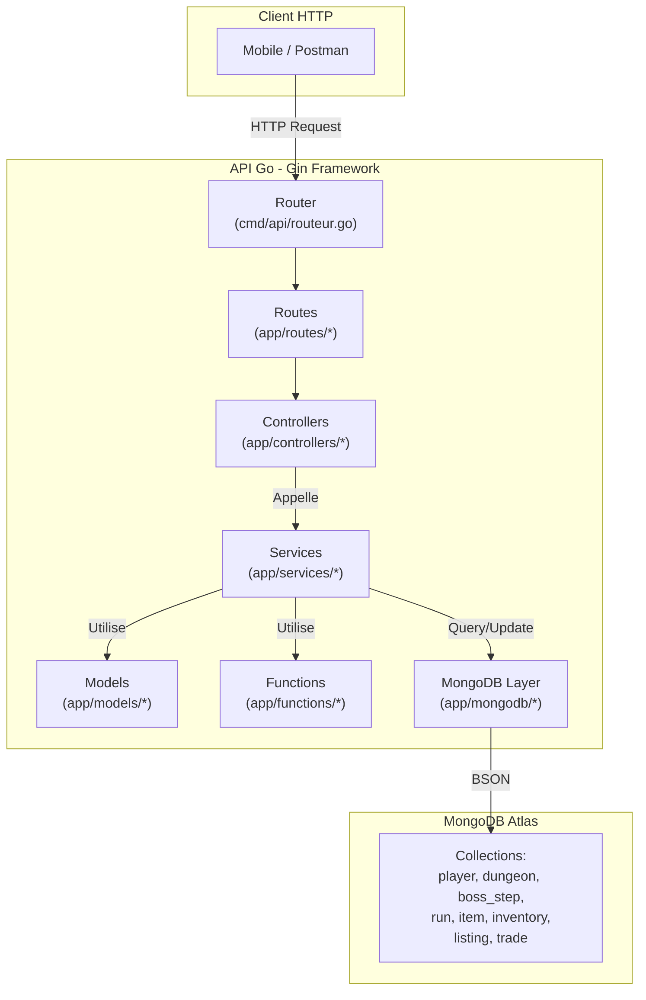

# Architecture du projet

[< Retour au sommaire](README.md)

---

## Vue d'ensemble

Le projet suit une **architecture en couches** (layered architecture) classique pour une API REST Go :

```
dungeons/
├── cmd/api/              # Point d'entree, config serveur, routeur
├── app/
│   ├── models/           # Structs du domaine (entites MongoDB)
│   ├── services/         # Logique metier (regles de jeu, transactions)
│   ├── controllers/      # Handlers HTTP (deserialization, validation, reponses)
│   ├── routes/           # Enregistrement des routes Gin par domaine
│   ├── mongodb/          # Connexion + constructeurs de requetes BSON
│   ├── functions/        # Utilitaires (UUID, Haversine, crypto, validation)
│   └── server/           # Singleton serveur (Database, Router, Config)
└── doc/                  # Documentation
```

## Diagramme d'architecture



## Responsabilites de chaque couche

| Couche | Responsabilite | Exemple |
|--------|---------------|---------|
| **Routes** | Associer URL + methode HTTP a un controller | `POST /v1/runs` -> `runController.Create` |
| **Controllers** | Deserialiser le JSON, valider les entrees, choisir le code HTTP de reponse | Renvoyer `409` si `WRONG_STEP_ORDER` |
| **Services** | Logique metier pure : regles de jeu, transactions, calculs | Verifier la distance Haversine, rouler le loot |
| **Models** | Definition des structs Go avec tags BSON/JSON | `Dungeon`, `BossStep`, `Run`, etc. |
| **MongoDB** | Connexion, construction de filtres BSON, serialisation | `SelectConstructeur`, `ToDoc` |
| **Functions** | Utilitaires reutilisables sans etat | `HaversineDistance`, `NewUUID` |

## Stack technique

| Composant | Technologie | Version |
|-----------|-------------|---------|
| Langage | Go | 1.25.4 |
| Framework HTTP | Gin | 1.11.0 |
| Base de donnees | MongoDB Atlas | via mongo-driver/v2 |
| Validation | go-playground/validator | v10.27.0 |
| Logging | zerolog | 1.34.0 |
| UUID | gofrs/uuid | 4.4.0 |
