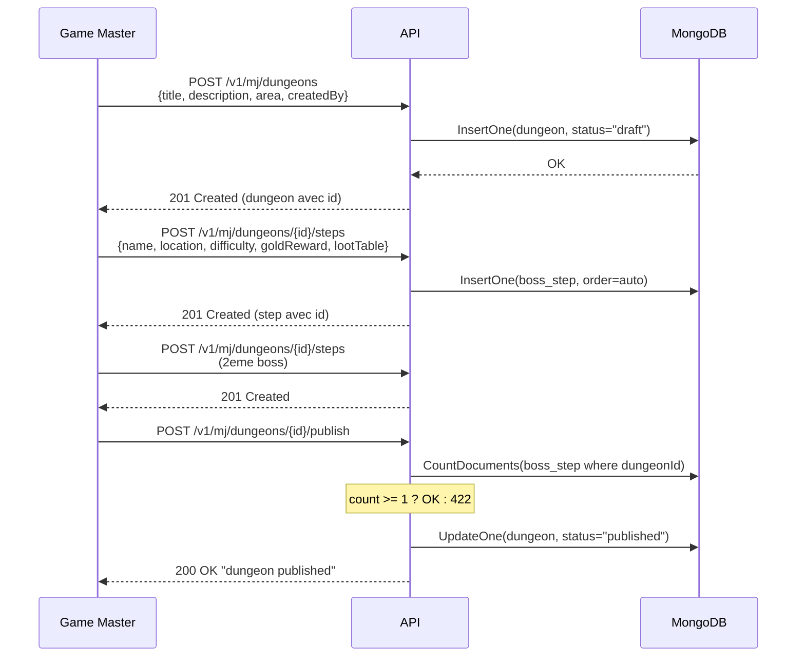

# Parcours de la donnee

[< Retour au sommaire](README.md)

---

## Flux d'une requete HTTP typique

L'exemple ci-dessous illustre le parcours complet d'un **Boss Attempt**, la requete la plus complexe de l'API.

```mermaid
sequenceDiagram
    participant C as Client
    participant R as Router/Routes
    participant CT as Controller
    participant S as Service
    participant M as MongoDB

    C->>R: POST /v1/runs/{id}/steps/{stepId}/attempt<br/>Body: { lat, lon }
    R->>CT: runController.AttemptBoss(ctx)
    CT->>CT: BindJSON -> extraire lat, lon
    CT->>S: RunService.AttemptBoss(runID, stepID, lat, lon)

    S->>M: FindOne(run by customID)
    M-->>S: Run document

    S->>S: Verifier run.State == "active"
    S->>S: Verifier idempotence (boss deja tue?)

    S->>M: FindOne(boss_step by customID)
    M-->>S: BossStep document

    S->>S: Verifier boss.Order == run.CurrentStep
    S->>S: HaversineDistance(player, boss) <= radiusMeters?
    S->>S: Rouler le loot (dropRate, minQty, maxQty)

    rect rgb(40, 40, 80)
        Note over S,M: Transaction Atomique MongoDB
        S->>M: Update run (killedSteps, currentStep, state?)
        S->>M: Update player (gold += goldReward)
        S->>M: Upsert inventory (pour chaque item du loot)
    end

    S-->>CT: AttemptResult { success, rewards, runCompleted }
    CT-->>C: 200 OK + WSResponse { meta, data }
```

## Flux de creation d'un donjon (Game Master)

## Flux de l'Auction House

```mermaid
sequenceDiagram
    participant Seller as Vendeur
    participant API as API
    participant DB as MongoDB
    participant Buyer as Acheteur

    Seller->>API: POST /v1/auction/listings<br/>{sellerId, itemId, qty, pricePerUnit}
    API->>DB: Verifier inventory (qty suffisante?)
    API->>DB: Deduire items de l'inventaire vendeur
    API->>DB: InsertOne(listing, status="active")
    API-->>Seller: 201 Created

    Buyer->>API: GET /v1/auction/listings
    API-->>Buyer: Liste des annonces actives

    Buyer->>API: POST /v1/auction/listings/{id}/buy<br/>{buyerId, qty}
    rect rgb(40, 40, 80)
        Note over API,DB: Transaction Atomique
        API->>DB: Debiter gold acheteur
        API->>DB: Crediter gold vendeur
        API->>DB: Upsert inventory acheteur (+items)
        API->>DB: Update listing (status/qty)
        API->>DB: InsertOne(trade record)
    end
    API-->>Buyer: 200 OK "purchase successful"
```

