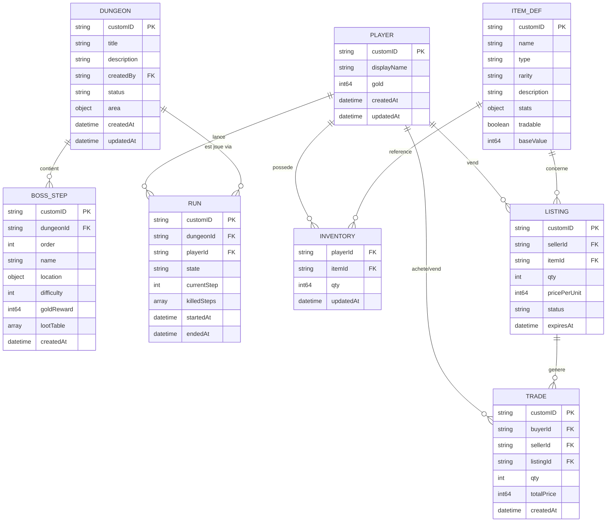

# Modele de donnees

[< Retour au sommaire](README.md)

---

## Diagramme entite-relation

## Collections MongoDB

| Collection | Cle primaire | Index supplementaires |
|-----------|-------------|----------------------|
| `player` | `customID` | -- |
| `dungeon` | `customID` | `status` |
| `boss_step` | `customID` | `dungeonId` + `order` |
| `run` | `customID` | `playerId` + `dungeonId` + `state` |
| `item` | `customID` | -- |
| `inventory` | composite `(playerId, itemId)` | -- |
| `listing` | `customID` | `status` |
| `trade` | `customID` | -- |
