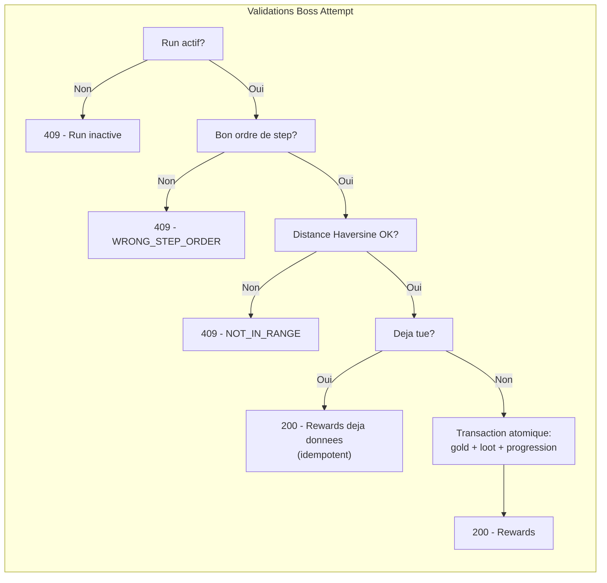

# Fonctionnalites implementees

[< Retour au sommaire](README.md)

---

## Tableau recapitulatif

| Domaine | Fonctionnalite | Endpoint | Statut |
|---------|---------------|----------|--------|
| **Sante** | Ping | `GET /ping` | OK |
| **Sante** | Version | `GET /version` | OK |
| **Players** | Creer un joueur | `POST /v1/players` | OK |
| **Players** | Lister les joueurs | `GET /v1/players` | OK |
| **Players** | Obtenir un joueur | `GET /v1/players/:id` | OK |
| **Players** | Mettre a jour | `POST /v1/players/:id` | OK |
| **Players** | Obtenir par IDs | `GET /v1/players/IDS/:ids` | OK |
| **Items** | Creer un item | `POST /v1/items` | OK |
| **Items** | Lister le catalogue | `GET /v1/items` | OK |
| **Items** | Obtenir un item | `GET /v1/items/:id` | OK |
| **Donjons** | Creer (draft) | `POST /v1/mj/dungeons` | OK |
| **Donjons** | Modifier (draft) | `PUT /v1/mj/dungeons/:id` | OK |
| **Donjons** | Publier | `POST /v1/mj/dungeons/:id/publish` | OK |
| **Donjons** | Lister (publies) | `GET /v1/dungeons` | OK |
| **Donjons** | Detail + boss steps | `GET /v1/dungeons/:id` | OK |
| **Boss Steps** | Creer | `POST /v1/mj/dungeons/:id/steps` | OK |
| **Boss Steps** | Modifier | `PUT /v1/mj/dungeons/:id/steps/:stepId` | OK |
| **Boss Steps** | Reordonner | `PUT /v1/mj/dungeons/:id/steps/reorder` | OK |
| **Runs** | Demarrer un run | `POST /v1/runs` | OK |
| **Runs** | Lister (par joueur) | `GET /v1/runs` | OK |
| **Runs** | Detail d'un run | `GET /v1/runs/:id` | OK |
| **Runs** | Abandonner | `POST /v1/runs/:id/abandon` | OK |
| **Boss Attempt** | Tenter un boss | `POST /v1/runs/:id/steps/:stepId/attempt` | OK |
| **Inventaire** | Voir inventaire | `GET /v1/inventory` | OK |
| **Auction** | Creer annonce | `POST /v1/auction/listings` | OK |
| **Auction** | Lister annonces | `GET /v1/auction/listings` | OK |
| **Auction** | Acheter | `POST /v1/auction/listings/:id/buy` | OK |
| **Auction** | Annuler | `POST /v1/auction/listings/:id/cancel` | OK |
| **Leaderboard** | Classement | `GET /v1/leaderboard` | OK |

## Regles metier cles



## Formule Haversine

Utilisee pour valider la presence physique du joueur pres d'un boss :

```
a = sin²(dlat/2) + cos(lat1) * cos(lat2) * sin²(dlon/2)
c = 2 * atan2(sqrt(a), sqrt(1-a))
distance = R * c    (R = 6 371 000 m)
```

Si `distance <= boss.location.radiusMeters`, le joueur est considere "sur place".

## Systeme de loot dynamique

Chaque boss step possede un `goldReward` fixe et une `lootTable` optionnelle :

```json
{
  "goldReward": 150,
  "lootTable": [
    { "itemId": "sword-01", "dropRate": 0.8, "minQty": 1, "maxQty": 1 },
    { "itemId": "potion-hp", "dropRate": 0.5, "minQty": 1, "maxQty": 3 },
    { "itemId": "ring-rare", "dropRate": 0.05, "minQty": 1, "maxQty": 1 }
  ]
}
```

Pour chaque entree de la table, un tirage aleatoire `[0, 1)` determine si le drop a lieu. La quantite est ensuite tiree entre `minQty` et `maxQty`.
