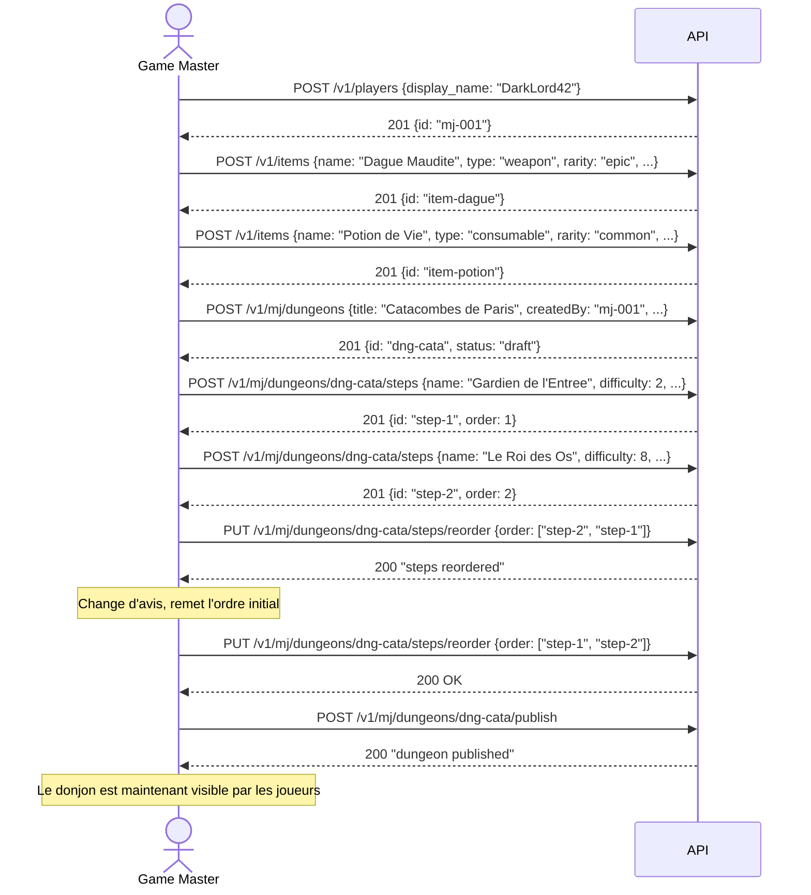
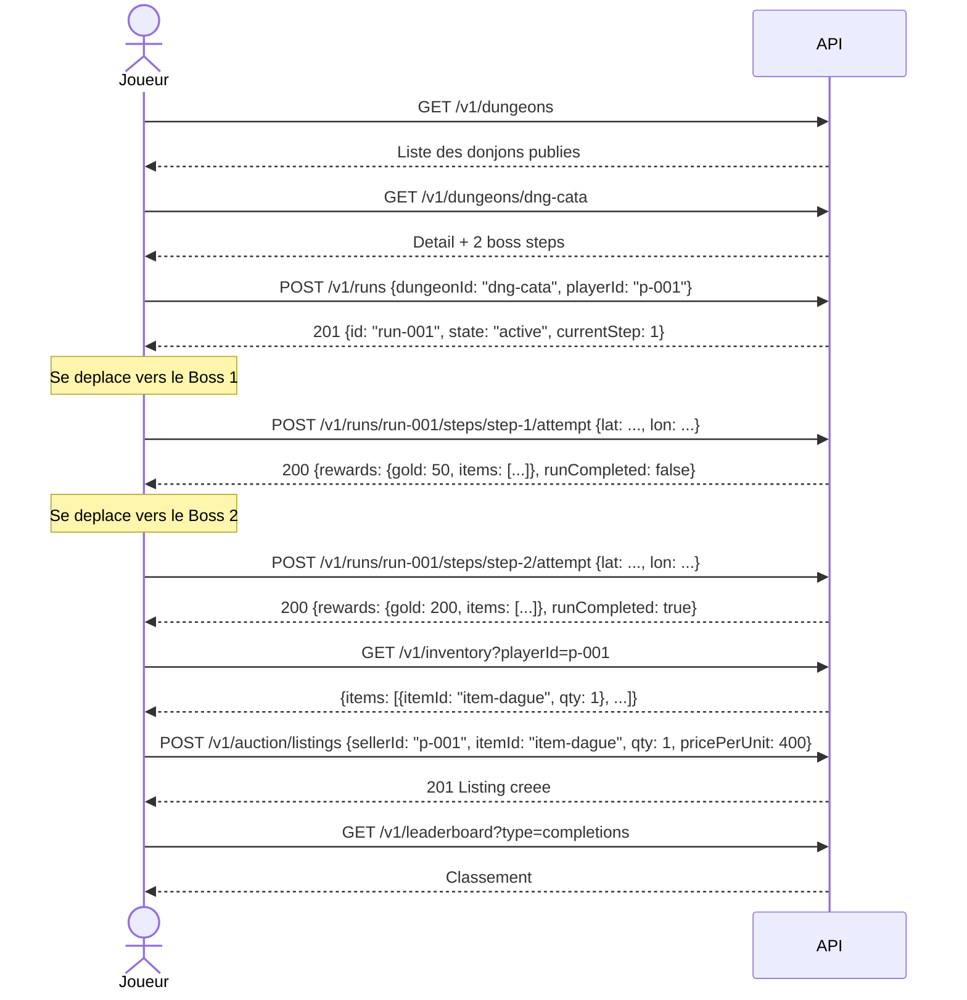
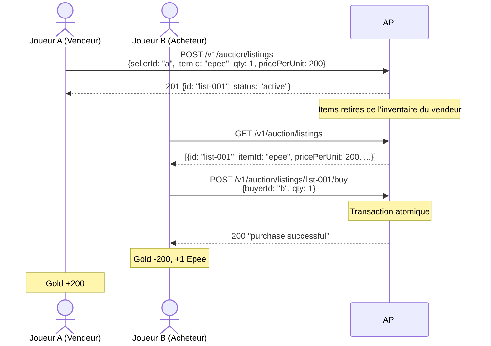

# Sessions utilisateur

[< Retour au sommaire](README.md)

---

## Session Game Master : creation d'un donjon

## Session Joueur : parcours d'un donjon

## Session Auction House : echange entre joueurs

